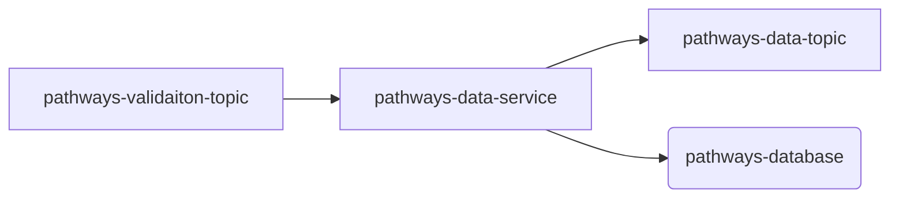
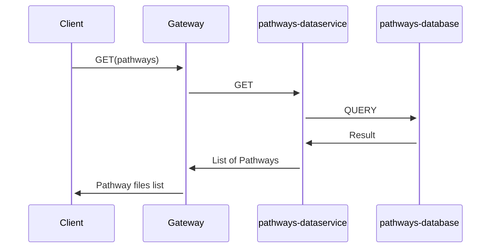

# Introduction 
Data service micro-service helps TDEI system to query information specific to the GTFS pathways.

# Getting Started
The project is built on top of NodeJS framework. All the regular nuances for a NodeJS project are valid for this.

## System requirements
| Software | Version|
|----|---|
| NodeJS | 16.17.0|
| Typescript | 4.8.2 |

### Local setup
Step 1: 
```docker compose up from root directory```

### Environment variables
|Name| Description |
|--|--|
| PROVIDER | Provider for cloud service or local (optional)|
|QUEUECONNECTION | Queue connection string |
|STORAGECONNECTION | Storage connection string|
|PORT |Port on which application will run|
|VALIDATION_SUBSCRIPTION | Upload topic subscription name|
|VALIDATION_TOPIC | Validation topic name|
|AUTH_HOST | Base URL for authentication host|
|POSTGRES_USER | Database user name|
|POSTGRES_HOST | Database host url|
|POSTGRES_PASSWORD | Database user password|
|POSTGRES_DB | Database name|
|POSTGRES_PORT | Database port|
|SSL | false when running locally otherwise true|
|STATION_URL | User management /station url|
|DATASVC_TOPIC | Data service topic|

An example of this is given in [example env file](./env.example)


#### Build and Test
Follow the steps to install the node packages required for both building and running the application

1. Install the dependencies. Run the following command in terminal on the same directory as `package.json`
    ```shell
    npm install
    ```
2. To start the server, use the command `npm run start`
3. The http server by default starts with 3000 port or whatever is declared in `process.env.PORT`
4. Other routes include a `ping` with get and post. Make `get` or `post` request to `http://localhost:3000/health/ping`


### Cloud Interaction
- This service listens to `pathways-validation` topic for all the validation messages
- If the validation is successful, it processes the message further
- After the metadata validation, it stores the information in postgresDB and then sends another message to `gtfs-pathways-data` topic
- This service also handles the GET request for all the pathways files



GET calls and interaction with DB



